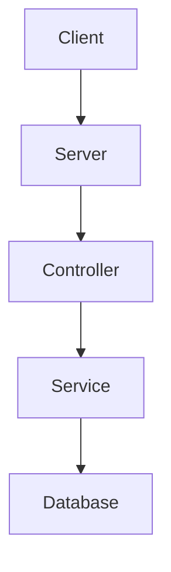
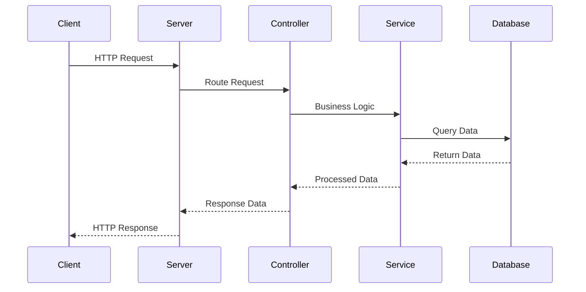

# Sample Node.js Application

This document provides an overview of a sample Node.js application, including architecture and flow diagrams created using Mermaid.

## Table of Contents
1. [Introduction](#introduction)
2. [Architecture](#architecture)
3. [Flow Diagram](#flow-diagram)
4. [References](#references)

## Introduction
This is a sample Node.js application designed to demonstrate basic concepts and structure.

## Architecture
The architecture of the application is depicted in the following diagram:

## Flow Diagram
The flow of the application is shown in the diagram below:

## References
- [Node.js Official Website](https://nodejs.org/)
- [Mermaid Documentation](https://mermaid-js.github.io/mermaid/#/)